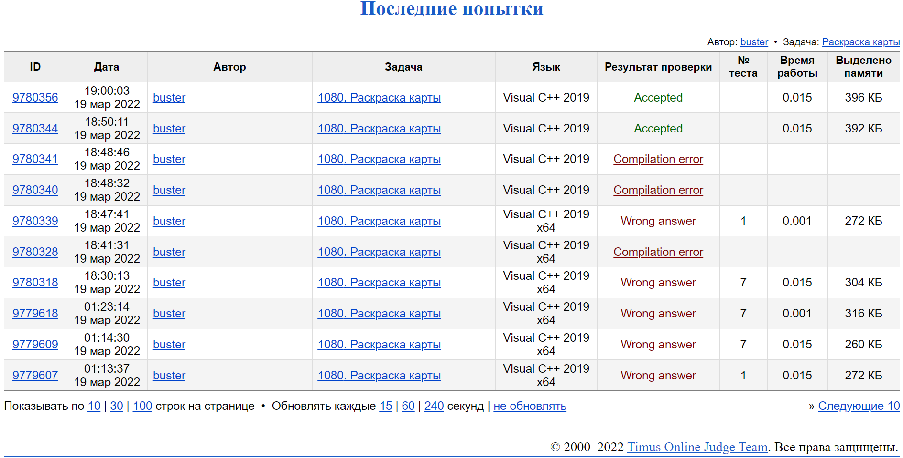

#### <div align="center"> [Задача 1080. Раскраска карты](https://acm.timus.ru/problem.aspx?space=1&num=1080) </div>

>Ограничение времени: 1.0 секунды
>Ограничение памяти: 64 МБ

###### Условие:

> Рассмотрим географическую карту с *N* странами, занумерованными от 1 до *N* (0 < *N* < 99). Для каждой страны известны номера соседних стран, т.е. имеющих общую границу с данной. Из каждой страны можно попасть в любую другую, перейдя некоторое количество границ. Напишите программу, которая определит, возможно ли покрасить карту только в два цвета — красный и синий — так, что если две страны имеют общую границу, их цвета различаются. Цвет первой страны — красный. Ваша программа должна вывести одну возможную раскраску для остальных стран или сообщить, что такая раскраска невозможна.

###### Исходные данные:

> В первой строке записано число *N*. Из следующих *N* строк *i*-я строка содержит номера стран, с которыми *i*-я страна имеет границу. Каждое целое число в *i*-й строке больше, чем *i*, кроме последнего, которое равно 0 и обозначает конец списка соседей *i*-й страны. Если строка содержит 0, это значит, что *i*-я страна не соединена ни с одной страной с б*o*льшим номером.

###### Результат:

> Вывод содержит ровно одну строку. Если раскраска возможна, эта строка должна содержать список нулей и единиц без разделителей между ними. *i*-я цифра в этой последовательности обозначает цвет *i*-й страны. 0 соответствует красному цвету, единица — синему. Если раскраска невозможна, выведите целое число –1.

| Исходные данные | Результат |
| --------------- | --------- |
| `3 2 0 3 0 0 `  | `010`     |

###### Описание алгоритма:

> Алгоритм решения задачи:
1. Создаем структуру данных *Country*, в которой будут содержавться данные о цвете и соседях страны
2. Заполняем динамический массив стран их соседями
3. Используя граф и номер стартовой вершины, на каждом шаге красим одну вершину в определённый цвет в зависимости от того какого цвета была предыдущая вершина
4. Если рядом две вершины одного цвета, то выходим из программы выводя -1, иначе выводим последовательность цветов

###### Использоваемые структуры данных:

> std::vector - динамический массив, элементы которого хранятся непрерывно, что означает, что доступ к элементам возможен не только через итераторы, но и с использованием смещений к обычным указателям на элементы.
> std::queue - структура данных, реализующая функциональность очереди, в частности, структуру данных FIFO (первым поступил, первым обслужен). Очередь помещает элементы в конец и извлекает их из начала. 

###### Реализация:

```cpp
#include <vector>
#include <queue>
#include <iostream>

using namespace std;

// struct than contains color and neighbors of country
struct Country {
    // -1 - none, 0 - red, 1 - blue
    int color = -1;

    // array that contains country neighbors
    vector<int> neighbors;
};

int main() {

    // reading number of countries
    int n;
    cin >> n;

    // creating array, containing countries
    // So that the numbering of countries goes from 1 and not from 0
    vector<Country> countries(n + 1);

    // buffer
    int countryNeighbor;

    // reading countries
    for (int i = 1; i <= n; i++) {

        cin >> countryNeighbor;

        while (countryNeighbor != 0) {

            // adding neighbor in array
            countries[i].neighbors.push_back(countryNeighbor);
            countries[countryNeighbor].neighbors.push_back(i);
            cin >> countryNeighbor;
        }
    }

    // coloring countries
    for (int i = 1; i <= n; i++) {

        // if current country don't colored yet
        if (countries[i].color == -1) {
            queue<int> countriesQueue;
            countriesQueue.push(i);
            countries[i].color = 0;

            // while we have at least one element in the queue
            while (!countriesQueue.empty()) {

                // retrieve the first element of the queue
                int first = countriesQueue.front(); countriesQueue.pop();

                // check if the country has a border with a country with the same color
                for (int i = 0; i < countries[first].neighbors.size(); i++) {
                    int neighbour = countries[first].neighbors[i];

                    // if neighboring countries are the same color
                    if (countries[first].color == countries[neighbour].color) {
                        cout << "-1";
                        exit(0);
                    }

                    // if not, then we paint it in a color different from the color of the current country
                    // and add a country to the queue to check
                    if (countries[neighbour].color == -1) {
                        countries[neighbour].color = (countries[first].color == 0 ? 1 : 0);
                        countriesQueue.push(neighbour);
                    }
                }
            }
        }
    }

    // result output
    for (int i = 1; i <= n; i++) cout << countries[i].color;

    return 0;
}
```

###### Подтверждение выполнения:


