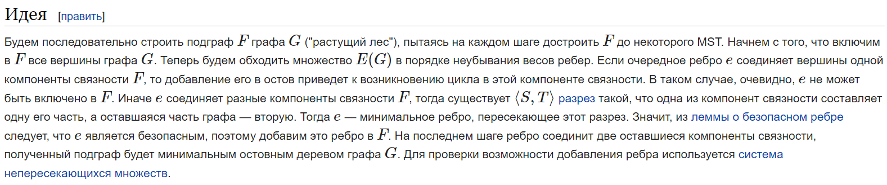
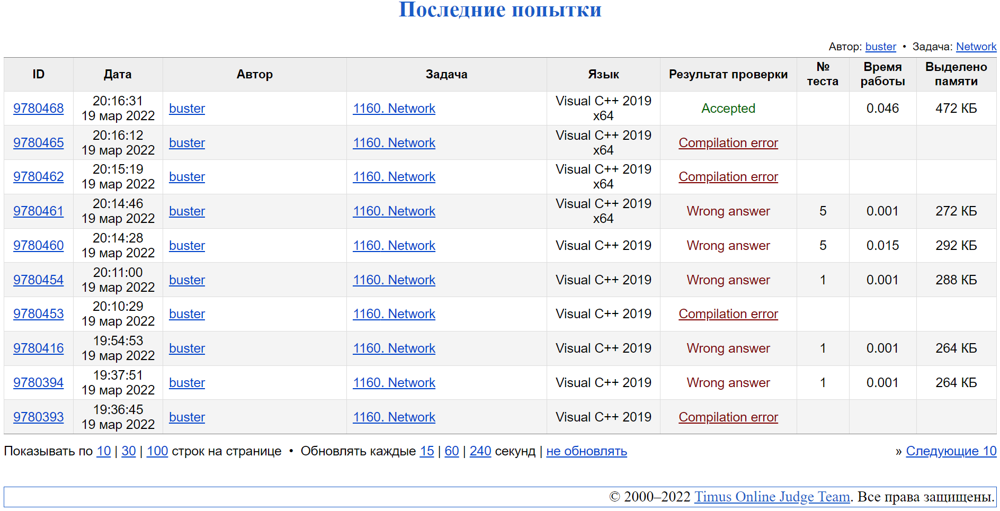

#### <div align="center"> [Задача 1160. Network](https://acm.timus.ru/problem.aspx?space=1&num=1160) </div>

>Ограничение времени: 1.0 секунды
>Ограничение памяти: 64 МБ

###### Условие:

> Эндрю работает системным администратором и планирует создать новую сеть в своей компании. В компании будет N хабов, они могут быть соединены друг с другом с помощью кабелей. Поскольку каждый сотрудник компании должен иметь доступ ко всей сети, каждый хаб должен быть доступен по кабелям от любого другого хаба (возможно, с некоторыми промежуточными хабами).
>
> Поскольку доступны кабели разных типов, а более короткие дешевле, необходимо составить такой план подключения хаба, чтобы максимальная длина одного кабеля была минимальной. Существует еще одна проблема - не каждый хаб может быть подключен к любому другому из-за проблем с совместимостью и ограничений геометрии здания. Конечно, Эндрю предоставит вам всю необходимую информацию о возможных подключениях к хабу.
>
> Вы должны помочь Эндрю найти способ подключения хабов таким образом, чтобы все вышеперечисленные условия были выполнены.

###### Исходные данные:

> Первая строка содержит два целых числа: N - количество хабов в сети (2 ≤ N ≤ 1000) и M — количество возможных подключений к хабу (1 ≤ M ≤ 15000). Все хабы пронумерованы от 1 до N. Следующие M строк содержат информацию о возможных соединениях - номера двух хабов, которые могут быть подключены, и длина кабеля, необходимая для их подключения. Длина - это целое положительное число, не превышающее 10^6. Для подключения двух хабов будет не более одного способа. Хаб не может быть подключен к самому себе. Всегда будет по крайней мере один способ подключения всех хабов.

###### Результат:

> Сначала выведите максимальную длину одного кабеля в вашем плане подключения к хабу (значение, которое вы должны свести к минимуму). Затем выведите свой план: сначала выведите P - количество используемых кабелей, затем выведите P пар целых чисел - количество хабов, подключенных соответствующим кабелем. Разделяйте числа пробелами и/или разрывами строк.

| Исходные данные | Результат |
|-----------------|-----------|
| `4 6 `          | `1  `     |
| `1 2 1 `        | `4`       |
| `1 3 1  `       | `1 2`     |
| `1 4 2 `        | `1 3`     |
| `2 3 1 `        | `2 3`     |
| `3 4 1 `        | `3 4`     |
| `2 4 1`         | ` `       |

###### Описание алгоритма:

> В данной задаче используется алгоритм Краскала на графах (алгоритм поиска минимального остовного дерева (англ. minimum spanning tree, MST) во взвешенном неориентированном связном графе)
> 
> Хабы представлены как вершины графа, а провода – рёбра
> При считывании все рёбра записываются в вектор и сортируются
> После – рёбра добавляются в граф с присвоением каждой вершине номера, соответствующего номеру подграфа, не соединенного с другими подграфам 
> В случае объединения двух подграфов им присваивается наименьший из их номеров
> Это продолжается до тех пор, пока все вершины графа не будут соединены

###### Реализация:

```cpp
#include <iostream>
#include <vector>
#include <algorithm>

using namespace std;

// struct that represents cable
struct Cable {
    // connectors
    int a, b;

    // length
    int length;
};

// comparator (length)
bool compare(Cable first, Cable second) {
    return first.length < second.length;
}

int main() {

    // reading the number of hubs and possible connections
    int n, m;
    cin >> n >> m;

    // array of possible connections
    vector<Cable> possibleConnections;

    // the numbers of two hubs, which can be connected and the cable length required to connect them
    int a, b, l;

    // buffer
    Cable buffer;

    // reading possible connections
    for (int i = 0; i < m; ++i) {
        cin >> a >> b >> l;
        buffer = {a - 1, b - 1, l};
        possibleConnections.push_back(buffer);
    }

    // sorting cables by descending
    sort(possibleConnections.begin(), possibleConnections.end(), compare);

    // auxiliary array for already used hubs
    vector<int> usedHubs (n, -1);
    // auxiliary array for already used cables
    vector<int> usedCables(m, 0);

    int hubValue = 0, maxLength = 0, requiredCables = 0;

    // loop through the list of all possible connections
    for (int i = 0; i < m; i++) {

        // hubs
        int &hubA = usedHubs[possibleConnections[i].a];
        int &hubB = usedHubs[possibleConnections[i].b];

        // if the hubs are already connected, then we can go further, since it will no longer be shorter due to sorting
        if (hubA != -1 and hubB != -1) continue;

        // if both hubs are not connected - connect
        else if (hubA == -1 and hubB == -1) {
            ++hubValue;
            hubA = hubValue;
            hubB = hubA;
        }

        // if only one hub connected, then connect to an existing network of a connected hub
        else if ((hubA != -1 and hubB == -1) or (hubA == -1 and hubB != -1)) {
            hubA = hubA + hubB + 1;
            hubB = hubA;
        }

        // the case of graph closure - choose the smallest level from two possible
        else {
            int minHubValue, maxHubValue;

            if (hubB > hubA) {
                minHubValue = hubA;
                maxHubValue = hubB;
            }
            else {
                minHubValue = hubB;
                maxHubValue = hubA;
            }

            for (int j = 0; j < n; j++) if (usedHubs[j] == maxHubValue) usedHubs[j] = minHubValue;
        }

        usedCables[i] = 1;
        maxLength = possibleConnections[i].length;
        ++requiredCables;
    }

    // result output
    cout << maxLength << endl << requiredCables << endl; // number of required cables and max length
    for (int j = 0; j < m; j++) if (usedCables[j])
            cout << possibleConnections[j].a + 1 << " " << possibleConnections[j].b + 1 << endl; // connections

    return 0;
}
```

###### Подтверждение выполнения:


