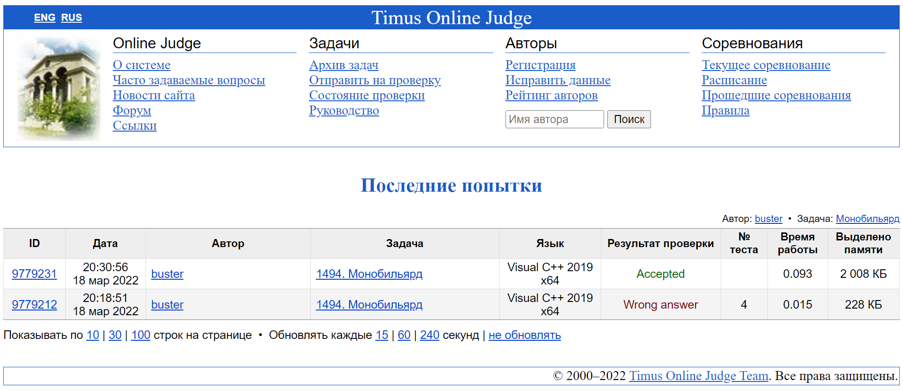

#### <div align="center"> [Задача 1494. Монобильярд](https://acm.timus.ru/problem.aspx?space=1&num=1494) </div>

>Ограничение времени: 1.0 секунды
>Ограничение памяти: 64 МБ

###### Условие:

> Стол для монобильярда, установленный в игровом доме уездного города N, оказался очень прибыльным вложением. До того, как в городе появился небезызвестный господин Чичиков. Раз за разом он выигрывал, и хозяин, подсчитывая убытки, понимал, что дело тут нечисто. Однако уличить подлеца в жульничестве не удавалось до прибытия в город N ревизора из Петербурга.
>
> Правила игры в монобильярд очень просты: нужно последовательно закатить в единственную лузу шары с номерами 1, 2, …, *N* (именно в этом порядке). Пока господин Чичиков играл, ревизор несколько раз подходил к столу и забирал из лузы последний закатившийся туда шар. В конце концов, оказалось, что Чичиков закатил в лузу все шары, а ревизор все шары достал и обследовал. Аферист утверждал, что закатил шары в правильном порядке. Хозяин понял, что это его шанс: ревизор должен помнить, в каком порядке он доставал шары. Однако так ли легко будет доказать жульничество?

###### Исходные данные:

> В первой строке записано целое число *N* — количество бильярдных шаров (1 ≤ *N* ≤ 100000). В следующих *N* строках даны номера этих шаров в том порядке, в котором ревизор забирал их из лузы.

###### Результат:

> Выведите слово «Cheater», если Чичиков не мог закатить все *N* шаров в правильном порядке. Иначе выведите «Not a proof».

| Исходные данные | Результат      |
| --------------- | -------------- |
| `2 2 1 `        | `Not a proof ` |
| `3 3 1 2 `      | `Cheater`      |

###### Описание алгоритма:

> Реализованный алгоритм таков:
1. Читается количество вытащенных шаров
2. В цикле *for* проиходит чтение текущего вытащенного шара и проверка на cheating:
   * первый вытащенный шар означает, что были забиты все шары до номера вытащенного шара включительно
   * если номер текущего вытащенного шара больше чем номер предыдущего, это значит что были забиты шары от предыдущего до текущего номера включительно
   * если номер текущего равен номеру предыдущего, то был забил предыдущий и текущий
   * если номер текущего меньше, чем предыдущего, то произошел cheating

###### Реализация:

```cpp
#include <iostream>
#include <vector>

using namespace std;

int main() {
    
    // reading number of pulled out balls
    int n;
    cin >> n;

    // array for balls
    vector<int> balls(n);
    
    // buffer
    int currentBall;
    
    // previous ball
    int prevBall = 0;
    
    // reading and checking for cheating
    for (int i = 0; i < n; i++) {
        
        cin >> currentBall;

        // adding elements in array
        if (currentBall > prevBall) {
            for (int j = prevBall + 1; j <= currentBall - 1; j++) balls.push_back(j);
            prevBall = currentBall;
        }
        
        // delete last element
        else if (currentBall == balls.back()) balls.pop_back();
        
        // cheater if current ball less that last
        else {
            
            // answer output
            cout << "Cheater" << endl;
            
            return 0;
        }
    }
    
    // answer output
    cout << "Not a proof" << endl;
    
    return 0;
}
```

###### Подтверждение выполнения:

