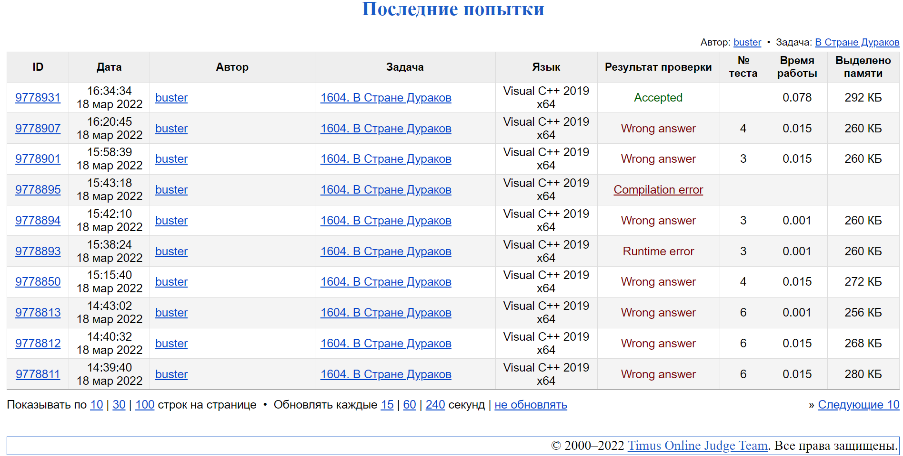

#### <div align="center"> [Задача 1604. В стране дураков](https://acm.timus.ru/problem.aspx?space=1&num=1604) </div>

>Ограничение времени: 1.0 секунды
>Ограничение памяти: 64 МБ

###### Условие:

> Главный бульдог-полицейский Страны Дураков решил ввести ограничение скоростного режима на автомобильной трассе, ведущей от Поля Чудес к пруду Черепахи Тортиллы. Для этого он заказал у Папы Карло *n* знаков ограничения скорости. Папа Карло слабо разбирался в дорожном движении и поэтому изготовил знаки с разными ограничениями на скорость: 49 км/ч, 34 км/ч, 42 км/ч, и т.д. Всего получилось *k* различных ограничений: *n*1 знаков с одним ограничением, *n*2 знаков со вторым ограничением, и т.д. (*n*1 + … + *nk* = *n*)
> Бульдог-полицейский ничуть не расстроился, получив такие знаки, напротив, он решил извлечь из этого экономическую выгоду. Дело в том, что по Правилам дорожного движения Страны Дураков ограничение на скорость действует вплоть до следующего знака. Если на знаке написано число 60, это означает, что участок от данного знака до следующего нужно проехать ровно со скоростью 60 километров в час — не больше и не меньше. Бульдог распорядился расставить знаки так, чтобы обогатившимся на Поле Чудес автолюбителям во время своего движения по трассе приходилось как можно больше раз менять скорость. Для этого нужно расставить имеющиеся знаки в правильном порядке. Если Вы поможете бульдогу это сделать, то он готов будет поделиться с Вами частью своих доходов.

###### Исходные данные:

> В первой строке дано число *k* — количество различных типов знаков с ограничением скорости (1 ≤ *k* ≤ 10000). Во второй строке через пробел перечислены целые положительные числа *n*1, …, *nk*. Сумма всех *ni* не превосходит 10000.

###### Результат:

> Выведите *n* целых чисел в пределах от 1 до *k* — порядок, в котором нужно расставить по трассе имеющиеся знаки. Вне зависимости от того, какой знак стоит первым, считается, что, проезжая его, водитель меняет скорость, так как до этого ограничения не действовали. Если задача имеет несколько решений, выведите любое.

| Исходные данные | Результат |
|-----------------| --------- |
| `2 2 2`         | `1 2 1 2` |
| `2   `          | `1 2 1 2` |

###### Описание алгоритма:

> Алгоритм можно разделить на несколько частей:
1. Запись в массив количества каждого из типов знаков
2. В цикле *while* происходит расстановка знаков. Каждый следующий знак определяется как знак, количество которых максимально и тип данного знака отличен от предыдущего. На каждой итерации происходит вывод результата

###### Реализация:

```cpp
#include <iostream>
#include <vector>

using namespace std;

// function to search for the index of the sign with the largest number excluding some index
int findMaxIndexExcept(vector<int> &roadSigns, int len, int exclusiveIndex) {
    
    int maxSign = 0;
    int result = -1;
    
    for (int i = 0; i < len; i++) {
        if (i != exclusiveIndex && roadSigns[i] > maxSign) {
            maxSign = roadSigns[i];
            result = i;
        }
    }

    return result;
}

int main() {

    // data input

    // number of different types of road signs
    int typesOfSigns;
    cin >> typesOfSigns;

    // dynamic array, containing signs
    vector<int> roadSigns(typesOfSigns);

    // total number of road signs
    int total = 0;

    // reading sings restrictions number in array
    for (int i = 0; i < typesOfSigns; i++) {
        cin >> roadSigns[i];
        total += roadSigns[i];
    }

    // previous used road sign index
    int prevSignIndex = -1;
    // the index of the max sign number
    int maxSignIndex;

    // main loop
    while (total) { // until all signs are used
        
        // find max sign index, exclude the previous one
        maxSignIndex = findMaxIndexExcept(roadSigns, typesOfSigns, prevSignIndex);
        
        // if not other signs, then use the previous
        if (maxSignIndex == -1) maxSignIndex = prevSignIndex;

        roadSigns[maxSignIndex] -= 1;
        prevSignIndex = maxSignIndex;

        // result output
        cout << maxSignIndex + 1 << ' ';

        total--;
    }

    return 0;
}
```

###### Подтверждение выполнения:
