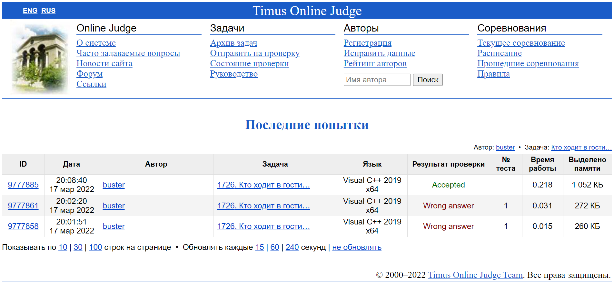

#### <div align="center"> [1726. Кто ходит в гости](https://acm.timus.ru/problem.aspx?space=1&num=1726) </div>

>Ограничение времени: 1.0 секунды
>Ограничение памяти: 64 МБ

###### Условие:

> Программный комитет школьных соревнований по программированию, проходящих в УрГУ — многочисленная, весёлая и дружная команда. Дружная настолько, что общения в университете им явно не хватает, поэтому они часто ходят друг к другу в гости. Все ребята в программном комитете очень спортивные и ходят только пешком.
>
> Однажды хранитель традиций олимпиадного движения УрГУ подумал, что на пешие прогулки от дома к дому члены программного комитета тратят слишком много времени, которое могли бы вместо этого потратить на придумывание и подготовку задач. Чтобы доказать это, он решил посчитать, какое расстояние в среднем преодолевают члены комитета, когда ходят друг к другу в гости. Хранитель традиций достал карту Екатеринбурга, нашёл на ней дома всех членов программного комитета и выписал их координаты. Но координат оказалось так много, что хранитель не смог справиться с этой задачей самостоятельно и попросил вас помочь ему.
>
> Город Екатеринбург представляет собой прямоугольник со сторонами, ориентированными по сторонам света. Все улицы города идут строго с запада на восток или с севера на юг, проходя через весь город от края до края. Дома всех членов программного комитета расположены строго на пересечении каких-то двух перпендикулярных улиц. Известно, что все члены комитета ходят только по улицам, поскольку идти по тротуару гораздо приятнее, чем по дворовым тропинкам. И, конечно, при переходе от дома к дому они всегда выбирают кратчайший путь. Программный комитет очень дружный, и все его члены ходят в гости ко всем одинаково часто.

###### Исходные данные:

> Первая строка содержит целое число *n* — количество членов программного комитета (2 ≤ *n* ≤ 10^5). В *i*-й из следующих *n* строк через пробел записаны целые числа *xi*, *yi* — координаты дома *i*-го члена программного комитета (1 ≤ *xi*, *yi* ≤ 10^6).

###### Результат:

> Выведите среднее расстояние, которое проходит член программного комитета от своего дома до дома своего товарища, округлённое вниз до целых.

| Исходные данные | Результат |
|-----------------|-----------|
| `3 `            | ` 13`     |
| `10 10 `        |           |
| `20 20 `        |           |
| `10 20`         |           |

###### Описание алгоритма:

> Реализованный алгоритм состояит из следующих частей:
1. Ввод исходных данных в два динамических массива отдельно координаты по оси X и по оси Y
2. Независимо сортируем массивы по возрастанию с помощьью алгоритма быстрой сортировки. Мы можем разделить массив координат на два не связанных массива так как все равно перемещение происходит по кратчайшим x и y независимо
3. Находим разность координат и находим путь между двумя ближайшими домами
4. Находим количество перемещений из начального дома в дома с большими (n-i) координатами и в дома с меньшими (i) и умножим на два так как всегда будет возврат в начальную точку
5. Усредняем и выводим результат

В качестве алгоритма сортировки была выбрана "Быстрая сортировка". Метод основан на принципе "разделяй-и-властвуй".
Его общая схема такова:
1. из массива выбирается некоторый опорный элемент *a[i]*
2. запускается процедура разделения массива, которая перемещает все ключи, меньшие, либо равные *a[i]*, влево от него, а все ключи, большие, либо равные *a[i]* - вправо
3. теперь массив состоит из двух подмножеств, причем левое меньше, либо равно правого
  
4. для обоих подмассивов: если в подмассиве более двух элементов, рекурсивно запускаем для него ту же процедуру

###### Реализация:

```cpp
#include <iostream>
#include <vector>

using namespace std;

// just swapping dots function
void swap(int* first, int* second) {
    int buffer = *first;
    *first = *second;
    *second = buffer;
}

// my implementation of quick sort
void quickSort(vector<int> &vec, long long left, long long right) {
    long long i = left;
    long long j = right;
    long long mid = left + (right - left) / 2;

    // pivot element
    int piv = vec[mid];

    // main loop
    while (i<right || j>left) {
        while (vec[i] < piv) i++;
        while (vec[j] > piv) j--;
        if (i <= j) {
            swap(&vec[i],&vec[j]);
            i++; j--;
        } else {
            if (i < right) quickSort(vec, i, right);
            if (j > left) quickSort(vec, left, j);
            return;
        }
    }
}

int main() {

    // data input
    long long n;
    cin >> n;

    vector<int> xCoords(n);
    vector<int> yCoords(n);

    for (long long i = 0; i < n; i++) cin >> xCoords[i] >> yCoords[i];

    // sorting arrays
    quickSort(xCoords, 0, n - 1);
    quickSort(yCoords, 0, n - 1);

    // sum coords
    long long sum = 0;
    for (long long i = 1; i < n; i++) {

        // calculation of the distance in coordinates to the neighboring house
        int xNearestHouse = xCoords[i] - xCoords[i - 1];
        int yNearestHouse = yCoords[i] - yCoords[i - 1];

        // the sum of the distances traveled along the road section in the direction of large (n-i)
        // and in the direction of smaller (i) coordinates
        // counts twice as there must be a way back to your home
        sum += (xNearestHouse + yNearestHouse) * i * (n - i) * 2;
    }

    // calculate mean value of path
    sum = sum / (n * (n - 1));

    // result input
    cout << sum << endl;

    return 0;
}
```

###### Подтверждение выполнения:
